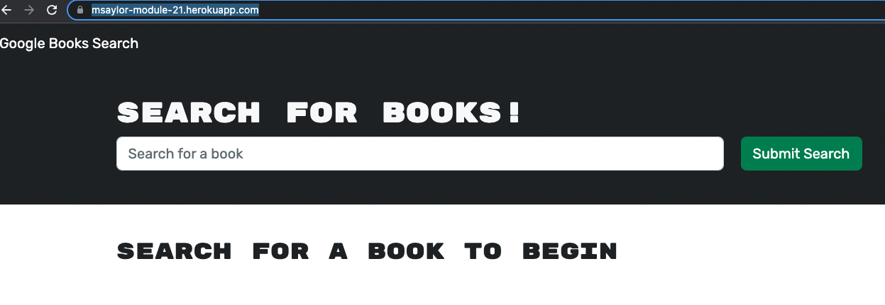

# MERN-book-search-engine

## Description

Use this app to find and save your favorite books from the GoogleBooks API!
I reconfigured the backend of this application to work following the MERN stack.
Using Apollo and GraphQL you can now signup, login, save, and delete books from your database.

## License

Click the badge above for more information on this license!

## Usage

If you follow the link below you will be able to make an account and start your collection!

## Link to Deployed Webpage

[Click here to see!](https://msaylor-module-21.herokuapp.com/)

## Questions

If you have any further questions for me you can contact me through my email as seen below. 

[Click here for my Github!](https://github.com/msaylorphila)
[Click here to Email me!](mailto:saylor.margaret@gmail.com)
